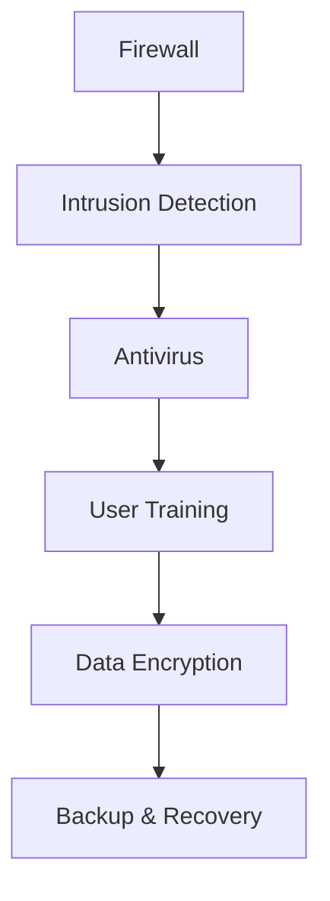

# An ninh mạng cơ bản - Bảo vệ thông tin trong thời đại số

An ninh mạng (Cybersecurity) là một lĩnh vực quan trọng trong thời đại số hóa hiện nay. Là sinh viên chuyên ngành An ninh mạng tại HUTECH, tôi muốn chia sẻ những kiến thức cơ bản về lĩnh vực này.

## An ninh mạng là gì?

An ninh mạng là việc bảo vệ hệ thống, mạng và dữ liệu khỏi các cuộc tấn công kỹ thuật số. Nó bao gồm:

- **Bảo vệ dữ liệu**: Đảm bảo thông tin nhạy cảm không bị rò rỉ
- **Bảo vệ hệ thống**: Ngăn chặn các cuộc tấn công vào máy tính và mạng
- **Bảo vệ người dùng**: Giữ an toàn cho người dùng khi sử dụng internet

## Các mối đe dọa phổ biến

### 1. Malware (Phần mềm độc hại)

```bash
# Các loại malware phổ biến
- Virus: Tự nhân bản và lây lan
- Trojan: Ẩn mình trong phần mềm hợp pháp
- Ransomware: Mã hóa dữ liệu và đòi tiền chuộc
- Spyware: Thu thập thông tin cá nhân
- Adware: Hiển thị quảng cáo không mong muốn
```

### 2. Phishing (Lừa đảo trực tuyến)

Phishing là kỹ thuật lừa người dùng cung cấp thông tin nhạy cảm:

```html
<!-- Ví dụ email phishing -->
From: bank@fakebank.com
Subject: Cập nhật thông tin tài khoản

Xin chào,
Vui lòng click vào link để cập nhật thông tin tài khoản:
http://fake-bank-site.com/update-account
```

### 3. SQL Injection

Tấn công vào cơ sở dữ liệu thông qua lỗ hổng SQL:

```sql
-- Ví dụ SQL Injection
-- Input bình thường:
SELECT * FROM users WHERE username = 'admin' AND password = 'password123'

-- Input độc hại:
SELECT * FROM users WHERE username = 'admin' AND password = '' OR '1'='1'
```

## Các nguyên tắc bảo mật cơ bản

### 1. CIA Triad

- **Confidentiality (Bảo mật)**: Chỉ người được ủy quyền mới truy cập được
- **Integrity (Toàn vẹn)**: Dữ liệu không bị thay đổi trái phép
- **Availability (Sẵn sàng)**: Dịch vụ luôn hoạt động khi cần

### 2. Defense in Depth (Bảo vệ nhiều lớp)



## Mã hóa dữ liệu

### Symmetric Encryption (Mã hóa đối xứng)

```python
from cryptography.fernet import Fernet

# Tạo key
key = Fernet.generate_key()
cipher_suite = Fernet(key)

# Mã hóa
text = "Thông tin nhạy cảm"
encrypted_text = cipher_suite.encrypt(text.encode())

# Giải mã
decrypted_text = cipher_suite.decrypt(encrypted_text).decode()
```

### Asymmetric Encryption (Mã hóa bất đối xứng)

```python
from cryptography.hazmat.primitives import hashes
from cryptography.hazmat.primitives.asymmetric import rsa, padding

# Tạo cặp khóa
private_key = rsa.generate_private_key(
    public_exponent=65537,
    key_size=2048,
)
public_key = private_key.public_key()

# Mã hóa với public key
message = b"Thông tin bí mật"
encrypted = public_key.encrypt(
    message,
    padding.OAEP(
        mgf=padding.MGF1(algorithm=hashes.SHA256()),
        algorithm=hashes.SHA256(),
        label=None
    )
)
```

## Network Security

### Firewall Configuration

```bash
# iptables rules example
# Chặn tất cả traffic
iptables -P INPUT DROP
iptables -P FORWARD DROP
iptables -P OUTPUT DROP

# Cho phép SSH
iptables -A INPUT -p tcp --dport 22 -j ACCEPT

# Cho phép HTTP/HTTPS
iptables -A INPUT -p tcp --dport 80 -j ACCEPT
iptables -A INPUT -p tcp --dport 443 -j ACCEPT
```

### VPN (Virtual Private Network)

```bash
# OpenVPN configuration
client
dev tun
proto udp
remote vpn-server.com 1194
resolv-retry infinite
nobind
persist-key
persist-tun
ca ca.crt
cert client.crt
key client.key
cipher AES-256-CBC
```

## Web Application Security

### OWASP Top 10

1. **Injection**: SQL, NoSQL, OS injection
2. **Broken Authentication**: Lỗ hổng xác thực
3. **Sensitive Data Exposure**: Rò rỉ dữ liệu nhạy cảm
4. **XML External Entities (XXE)**: Tấn công XXE
5. **Broken Access Control**: Kiểm soát truy cập yếu
6. **Security Misconfiguration**: Cấu hình bảo mật sai
7. **Cross-Site Scripting (XSS)**: Tấn công XSS
8. **Insecure Deserialization**: Deserialization không an toàn
9. **Using Components with Known Vulnerabilities**: Sử dụng component có lỗ hổng
10. **Insufficient Logging & Monitoring**: Ghi log và giám sát không đủ

### XSS Prevention

```javascript
// ❌ Không an toàn
function displayUserInput(userInput) {
    document.getElementById('output').innerHTML = userInput;
}

// ✅ An toàn - Escape HTML
function displayUserInput(userInput) {
    const escaped = userInput
        .replace(/&/g, '&amp;')
        .replace(/</g, '&lt;')
        .replace(/>/g, '&gt;')
        .replace(/"/g, '&quot;')
        .replace(/'/g, '&#x27;');
    document.getElementById('output').textContent = escaped;
}
```

## Incident Response (Xử lý sự cố)

### Quy trình xử lý sự cố

1. **Preparation**: Chuẩn bị
2. **Identification**: Xác định sự cố
3. **Containment**: Ngăn chặn
4. **Eradication**: Loại bỏ mối đe dọa
5. **Recovery**: Khôi phục
6. **Lessons Learned**: Rút kinh nghiệm

```bash
# Script kiểm tra hệ thống
#!/bin/bash

# Kiểm tra processes đáng ngờ
ps aux | grep -E "(nc|netcat|ncat|socat)"

# Kiểm tra kết nối mạng
netstat -tulpn | grep LISTEN

# Kiểm tra file log
tail -f /var/log/auth.log
tail -f /var/log/syslog
```

## Security Tools

### Nmap (Network Scanner)

```bash
# Scan cơ bản
nmap -sS target.com

# Scan với service detection
nmap -sV -sC target.com

# Scan port range
nmap -p 1-1000 target.com

# Scan với timing
nmap -T4 target.com
```

### Wireshark (Network Analyzer)

```bash
# Capture packets
wireshark -i eth0

# Filter HTTP traffic
http

# Filter specific IP
ip.addr == 192.168.1.1

# Filter by port
tcp.port == 80
```

## Best Practices

### 1. Password Security

```python
import secrets
import string

def generate_strong_password(length=16):
    characters = string.ascii_letters + string.digits + string.punctuation
    password = ''.join(secrets.choice(characters) for _ in range(length))
    return password

# Sử dụng password hashing
import bcrypt

def hash_password(password):
    salt = bcrypt.gensalt()
    hashed = bcrypt.hashpw(password.encode('utf-8'), salt)
    return hashed

def verify_password(password, hashed):
    return bcrypt.checkpw(password.encode('utf-8'), hashed)
```

### 2. Two-Factor Authentication (2FA)

```python
import pyotp
import qrcode

# Tạo secret key
secret = pyotp.random_base32()

# Tạo TOTP
totp = pyotp.TOTP(secret)
current_otp = totp.now()

# Verify OTP
is_valid = totp.verify(current_otp)
```

### 3. Regular Updates

```bash
# Ubuntu/Debian
sudo apt update && sudo apt upgrade

# CentOS/RHEL
sudo yum update

# Kiểm tra security updates
sudo apt list --upgradable | grep security
```

## Career Path trong Cybersecurity

### Entry Level
- **Security Analyst**: Phân tích và giám sát bảo mật
- **Incident Responder**: Xử lý sự cố bảo mật
- **Vulnerability Assessor**: Đánh giá lỗ hổng

### Mid Level
- **Penetration Tester**: Kiểm tra xâm nhập
- **Security Engineer**: Thiết kế hệ thống bảo mật
- **Forensic Analyst**: Phân tích pháp y số

### Senior Level
- **Security Architect**: Kiến trúc sư bảo mật
- **CISO**: Giám đốc an ninh thông tin
- **Security Consultant**: Tư vấn bảo mật

## Certifications quan trọng

- **CompTIA Security+**: Nền tảng bảo mật
- **CEH (Certified Ethical Hacker)**: Hacker đạo đức
- **CISSP**: Chuyên gia bảo mật hệ thống
- **CISM**: Quản lý an ninh thông tin
- **CISA**: Kiểm toán hệ thống thông tin

## Kết luận

An ninh mạng là một lĩnh vực đang phát triển mạnh mẽ với nhiều cơ hội nghề nghiệp. Việc học và thực hành liên tục là chìa khóa để thành công trong lĩnh vực này.

Những kiến thức cơ bản trên sẽ giúp bạn có nền tảng vững chắc để tiếp tục học các chủ đề nâng cao hơn như:

- Penetration Testing
- Digital Forensics
- Security Architecture
- Risk Management
- Compliance & Governance

Hãy thực hành thường xuyên và tham gia các cộng đồng bảo mật để nâng cao kỹ năng!

---

*Bài viết được viết bởi Huỳnh Anh Khoa - Sinh viên HUTECH, chuyên ngành An ninh mạng*
